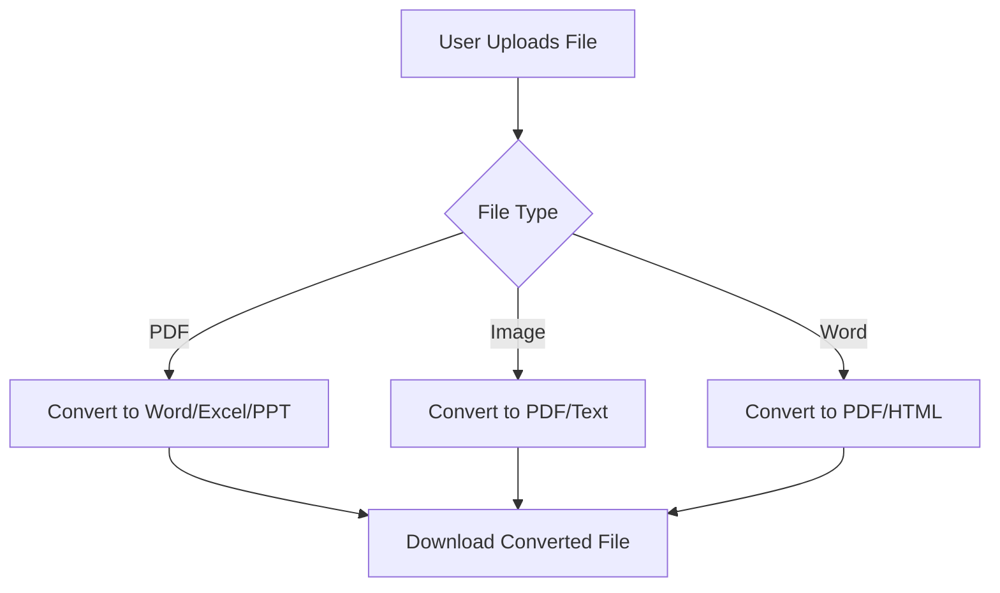

# FilePro - Ultimate File Conversion Suite


## 🌟 Overview

FilePro is a cutting-edge web application that provides seamless file conversion between various formats including PDF, Word, Excel, images, and more. Built with modern web technologies, it offers a sleek, animated interface with powerful conversion capabilities.



## 🚀 Features

### 🔄 Multi-Format Conversion
- PDF to Word/Excel/PowerPoint
- Images (JPG/PNG) to PDF/Text (OCR)
- Word to PDF/HTML
- Excel to CSV/PDF
- And many more combinations!

### ✨ Futuristic UI Elements
- Floating animated background particles
- Smooth card animations with hover effects
- Interactive progress indicators
- Toast notifications for user feedback
- Responsive design for all devices

### 🔒 Advanced Security
- Client-side processing (no server storage)
- Secure file handling
- Optional password protection for sensitive files

### ⚡ Performance Optimizations
- Fast conversion algorithms
- Web Workers for CPU-intensive tasks
- Chunked file processing for large files

## 🛠️ Technologies Used


## 🎥 UI Animations Preview


*Smooth animations include:*
- Floating background elements
- Card hover effects with 3D transforms
- Progress bars with shimmer effects
- Animated success indicators
- Morphing tab transitions

## 🏗️ Project Structure

```
file-converter-website/
├── assets/
│   ├── css/
│   │   └── main.css
│   ├── js/
│   │   ├── converter.js
│   │   ├── pdf.js
│   │   └── ocr.js
│   └── images/
├── index.html
├── tools/
│   ├── pdf-to-word.html
│   ├── image-to-pdf.html
│   └── ...
├── about.html
├── contact.html
└── README.md
```

## 🧰 Conversion Tools

| Tool | Description | Animation Effect |
|------|-------------|------------------|
| PDF to Word | Convert PDF documents to editable Word files | File drop zone pulses on hover |
| Image to Text | Extract text from images using OCR | Progress bar with scanning animation |
| PDF Protection | Add passwords and restrictions to PDFs | Shield icon animation when applied |
| Excel to CSV | Convert spreadsheets to comma-separated values | Data table transformation effect |

## 🌈 Color Scheme

```css
:root {
  --primary-color: #4361ee;
  --secondary-color: #3f37c9;
  --accent-color: #4895ef;
  --success-color: #4cc9f0;
  --warning-color: #f72585;
  --gradient-primary: linear-gradient(135deg, #4361ee, #3f37c9);
}
```

## 🖥️ System Requirements

- Modern web browser (Chrome, Firefox, Edge)
- JavaScript enabled
- For OCR features: Minimum 2GB RAM recommended

## 🚀 Getting Started

1. Clone the repository:
   ```bash
   git clone https://github.com/yourusername/file-converter-website.git
   ```

2. Open `index.html` in your browser

3. Or deploy to your favorite hosting service

## 🤝 Contributing

We welcome contributions! Please follow these steps:

1. Fork the project
2. Create your feature branch (`git checkout -b feature/AmazingFeature`)
3. Commit your changes (`git commit -m 'Add some AmazingFeature'`)
4. Push to the branch (`git push origin feature/AmazingFeature`)
5. Open a Pull Request

## 📜 License

Distributed under the MIT License. See `LICENSE` for more information.

## 📧 Contact

Project Lead: [Your Name] - your.email@example.com

Project Link: [https://github.com/yourusername/file-converter-website](https://github.com/yourusername/file-converter-website)

## 🎉 Acknowledgments

- [PDF-lib](https://pdf-lib.js.org/) for PDF manipulation
- [Tesseract.js](https://tesseract.projectnaptha.com/) for OCR capabilities
- [Font Awesome](https://fontawesome.com) for beautiful icons
- [Animate.css](https://animate.style/) for animation inspiration

---

<div align="center">
  <h3>✨ Transform Your Files with FilePro ✨</h3>
  <p>Experience the future of file conversion today!</p>
</div>